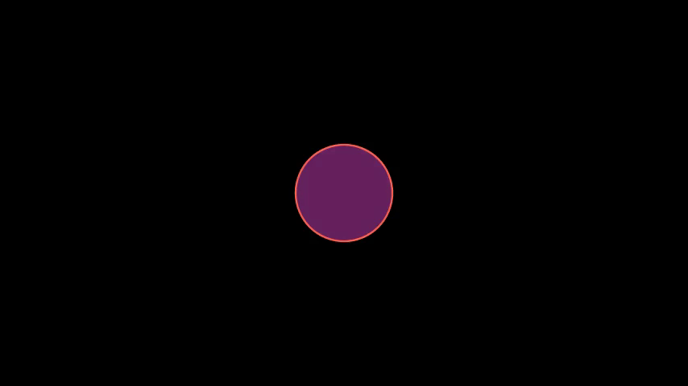
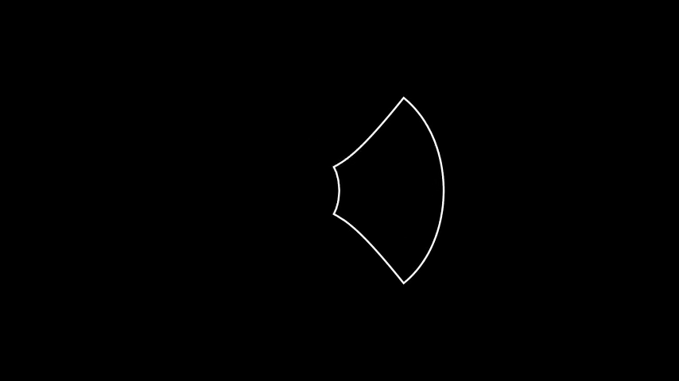
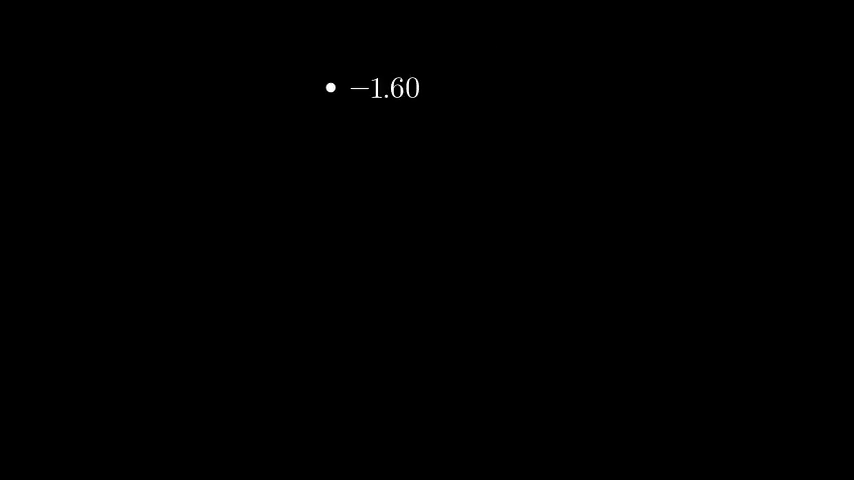

<br>
<p align="center">
<a href="https://github.com/Alimjoo/manim-example"></a>
</p>
<br>

# Opening Manim

```python
from manim import *

class OpeningManim(Scene):
    def construct(self):
        title = Tex(r"This is some \LaTeX")
        basel = MathTex(r"\sum_{n=1}^\infty \frac{1}{n^2} = \frac{\pi^2}{6}")
        VGroup(title, basel).arrange(DOWN)
        self.play(
            Write(title),
            FadeIn(basel, shift=DOWN),
        )
        self.wait()

        transform_title = Tex("That was a transform")
        transform_title.to_corner(UP + LEFT)
        self.play(
            Transform(title, transform_title),
            LaggedStart(*[FadeOut(obj, shift=DOWN) for obj in basel]),
        )
        self.wait()

        grid = NumberPlane()
        grid_title = Tex("This is a grid")
        grid_title.scale(1.5)
        grid_title.move_to(transform_title)

        self.add(grid, grid_title)  # Make sure title is on top of grid
        self.play(
            FadeOut(title),
            FadeIn(grid_title, shift=UP),
            Create(grid, run_time=3, lag_ratio=0.1),
        )
        self.wait()

        grid_transform_title = Tex(
            r"That was a non-linear function \\ applied to the grid"
        )
        grid_transform_title.move_to(grid_title, UL)
        grid.prepare_for_nonlinear_transform()
        self.play(
            grid.animate.apply_function(
                lambda p: p
                + np.array(
                    [
                        np.sin(p[1]),
                        np.sin(p[0]),
                        0,
                    ]
                )
            ),
            run_time=3,
        )
        self.wait()
        self.play(Transform(grid_title, grid_transform_title))
        self.wait()

```
# Square To Circle


```python 
class SquareToCircle(Scene):
    def construct(self):
        circle = Circle()
        square = Square()
        square.flip(RIGHT)
        square.rotate(-3 * TAU / 8)
        circle.set_fill(PINK, opacity=0.5)

        self.play(Create(square))
        self.play(Transform(square, circle))
        self.play(FadeOut(square))
```
# Updater Example

```python 
class UpdatersExample(Scene):
    def construct(self):
        decimal = DecimalNumber(
            0,
            show_ellipsis=True,
            num_decimal_places=3,
            include_sign=True,
        )
        square = Square().to_edge(UP)

        decimal.add_updater(lambda d: d.next_to(square, RIGHT))
        decimal.add_updater(lambda d: d.set_value(square.get_center()[1]))
        self.add(square, decimal)
        self.play(
            square.animate.to_edge(DOWN),
            rate_func=there_and_back ,
            run_time=5,
        )
        self.wait()
```
# Warp Square

```python 
class WarpSquare(Scene):
    def construct(self):
        square = Square()
        self.play(
            ApplyPointwiseFunction(
                lambda point: complex_to_R3(np.exp(R3_to_complex(point))), square
            )
        )
        self.wait()

```
# Width Example

```python
class WidthExample(Scene):
    def construct(self):
        decimal = DecimalNumber().to_edge(UP)
        rect = Square(color=BLUE)
        rect_copy = rect.copy().set_stroke(GRAY, opacity=0.5)

        decimal.add_updater(lambda d: d.set_value(rect.width))

        self.add(rect_copy, rect, decimal)
        self.play(rect.animate.set(width=6))
        self.wait()


```

# Write Stuff

``` python 

class WriteStuff(Scene):
    def construct(self):
        example_text = Tex("This is a some text", tex_to_color_map={"text": YELLOW})
        example_tex = MathTex(
            "\\sum_{k=1}^\\infty {1 \\over k^2} = {\\pi^2 \\over 6}",
        )
        group = VGroup(example_text, example_tex)
        group.arrange(DOWN)
        group.width = config["frame_width"] - 2 * LARGE_BUFF

        self.play(Write(example_text))
        self.play(Write(example_tex))
        self.wait()

```

# Next To Update

```python
class NextToUpdater(Scene):
    def construct(self):
        def dot_position(mobject):
            mobject.set_value(dot.get_center()[0])
            mobject.next_to(dot)
        dot = Dot(RIGHT*3)
        label = DecimalNumber()
        label.add_updater(dot_position)
        self.add(dot, label)
        self.play(Rotating(dot, about_point=ORIGIN, angle=TAU, run_time=TAU, rate_func=linear))
```

# Unit Circle with Sin() Cos()

```python
class UnitSinCos(Scene):
    def construct(self):

        grid = NumberPlane().set_opacity(0.3).scale(2)

        radius = 2
        circle = Circle(radius).set_color(WHITE)

        angle = math.pi
        dot = Dot(point=[radius*math.cos(angle), radius*math.sin(angle), 0]).set_color(GRAY)

        radiusU = VMobject()
        cosU = VMobject()
        sinU = VMobject()

        sin = DecimalNumber(0, num_decimal_places=3, include_sign=True, unit=None).move_to([-3.5, 2, 0]).set_color(YELLOW)
        sin.add_updater(lambda d: d.set_value(dot.get_center()[1]/2.0))
        cos = DecimalNumber(0, num_decimal_places=3, include_sign=True, unit=None).move_to([-3.5, 1, 0]).set_color(RED)
        cos.add_updater(lambda d: d.set_value(dot.get_center()[0]/2.0))
        sinText = Text("Sen = ").set_color(YELLOW).next_to(sin, LEFT)
        cosText = Text("Cos = ").set_color(RED).next_to(cos, LEFT)

        self.add(grid, circle, cosU, sinU, radiusU, dot, sin, cos, sinText, cosText)
        radiusU.add_updater(lambda x: x.become(Line(ORIGIN, dot.get_center()).set_color(GRAY)))
        cosU.add_updater(lambda x: x.become(Line(ORIGIN, [dot.get_center()[0], 0, 0]).set_color(RED)))
        sinU.add_updater(lambda x: x.become(Line([dot.get_center()[0], 0, 0], [dot.get_center()[0], dot.get_center()[1], 0]).set_color(YELLOW)))
        self.play(MoveAlongPath(dot, circle), rate_func=linear, run_time=10)
```
# Changing Camera Width And Restore

```python

class ChangingCameraWidthAndRestore(MovingCameraScene):
    def construct(self):
        text = Text("Helo Wrold").set_color(BLUE)
        self.add(text)
        self.camera.frame.save_state()
        self.play(self.camera.frame.animate.set(width=text.width * 1.2))
        self.wait(3)
        self.play(Restore(self.camera.frame))
```
# Moving Camera Center

```python

class MovingCameraCenter(MovingCameraScene):
    def construct(self):
        s = Square(color=RED, fill_opacity=0.5).move_to(2 * LEFT)
        t = Triangle(color=GREEN, fill_opacity=0.5).move_to(2 * RIGHT)
        self.wait(0.3)
        self.add(s, t)
        self.play(self.camera.frame.animate.move_to(s))
        self.wait(0.3)
        self.play(self.camera.frame.animate.move_to(t))
```

# Moving And Zooming Camera

```python
class MovingAndZoomingCamera(MovingCameraScene):
    def construct(self):
        s = Square(color=BLUE, fill_opacity=0.5).move_to(2 * LEFT)
        t = Triangle(color=YELLOW, fill_opacity=0.5).move_to(2 * RIGHT)
        self.add(s, t)
        self.play(self.camera.frame.animate.move_to(s).set(width=s.width*2))
        self.wait(0.3)
        self.play(self.camera.frame.animate.move_to(t).set(width=t.width*2))

        self.play(self.camera.frame.animate.move_to(ORIGIN).set(width=14))
```

# Moving Camera On Graph

```python
class MovingCameraOnGraph(GraphScene, MovingCameraScene):
    def setup(self):
        GraphScene.setup(self)

    def construct(self):
        self.camera.frame.save_state()
        self.setup_axes(animate=False)
        graph = self.get_graph(lambda x: np.sin(x),
                               color=WHITE,
                               x_min=0,
                               x_max=3 * PI
                               )
        dot_at_start_graph = Dot().move_to(graph.points[0])
        dot_at_end_graph = Dot().move_to(graph.points[-1])
        self.add(graph, dot_at_end_graph, dot_at_start_graph)
        self.play(self.camera.frame.animate.scale(0.5).move_to(dot_at_start_graph))
        self.play(self.camera.frame.animate.move_to(dot_at_end_graph))
        self.play(Restore(self.camera.frame))
        self.wait()
```
# Useful Annotations

```python
class UsefulAnnotations(Scene):
    def construct(self):
        m0 = Dot()
        m1 = AnnotationDot()
        m2 = LabeledDot("ii")
        m3 = LabeledDot(MathTex(r"\alpha").set_color(ORANGE))
        m4 = CurvedArrow(2*LEFT, 2*RIGHT, radius= -5)
        m5 = CurvedArrow(2*LEFT, 2*RIGHT, radius= 8)
        m6 = CurvedDoubleArrow(2*LEFT, 2*RIGHT, radius = 4)

        self.add(m0, m1, m2, m3, m4, m5, m6)
        for i, mobj in enumerate(self.mobjects):
            mobj.shift(DOWN * (i-3))

```
