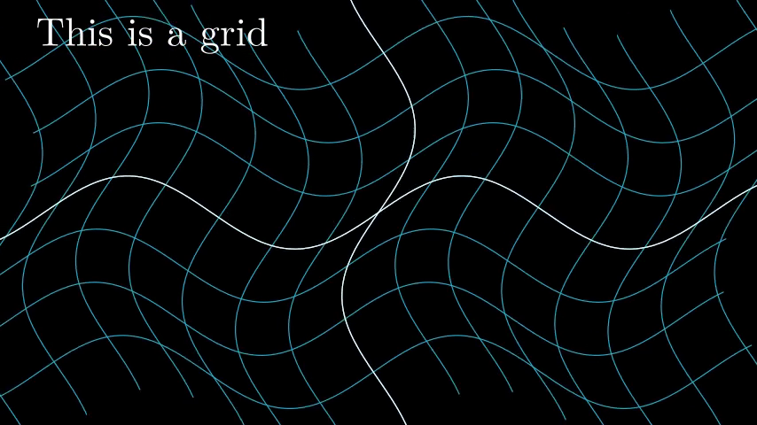
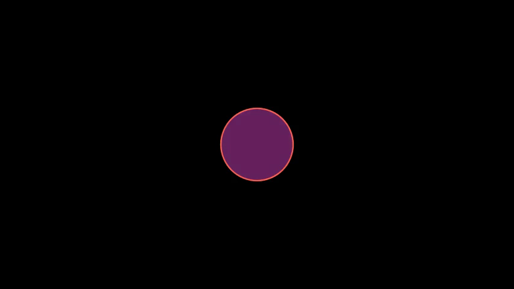
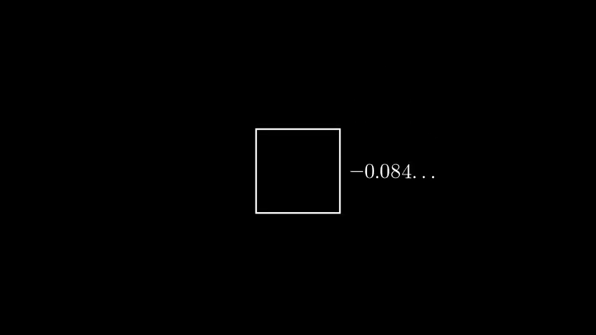
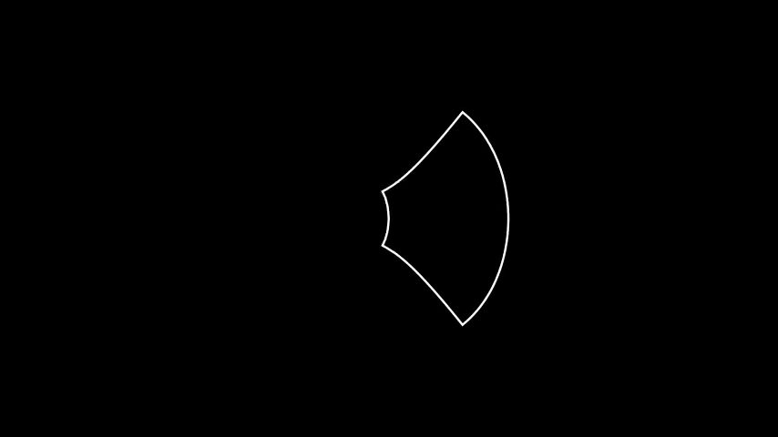
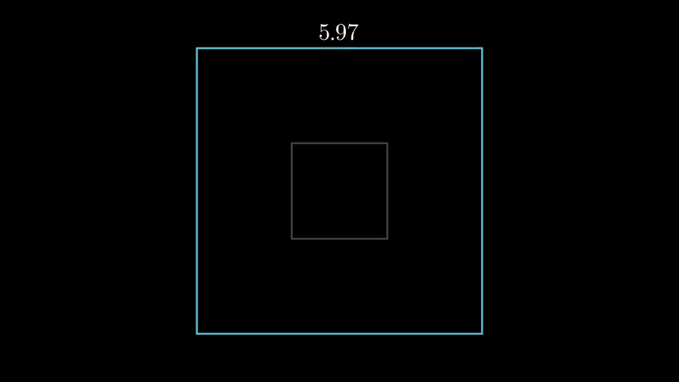
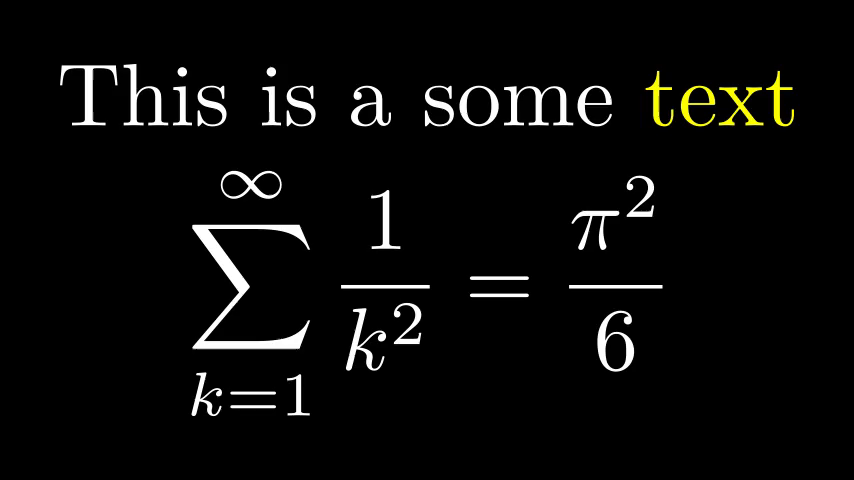
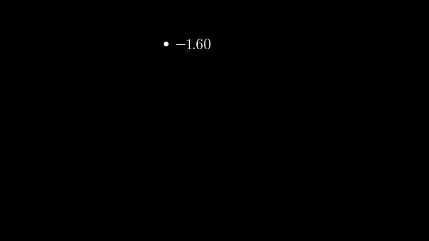

<p align="center">
<a href="https://github.com/Alimjoo/manim-example"></a>
</p>
<br>
<br>

# Opening Manim

```python
from manim import *

class OpeningManim(Scene):
    def construct(self):
        title = Tex(r"This is some \LaTeX")
        basel = MathTex(r"\sum_{n=1}^\infty \frac{1}{n^2} = \frac{\pi^2}{6}")
        VGroup(title, basel).arrange(DOWN)
        self.play(
            Write(title),
            FadeIn(basel, shift=DOWN),
        )
        self.wait()

        transform_title = Tex("That was a transform")
        transform_title.to_corner(UP + LEFT)
        self.play(
            Transform(title, transform_title),
            LaggedStart(*[FadeOut(obj, shift=DOWN) for obj in basel]),
        )
        self.wait()

        grid = NumberPlane()
        grid_title = Tex("This is a grid")
        grid_title.scale(1.5)
        grid_title.move_to(transform_title)

        self.add(grid, grid_title)  # Make sure title is on top of grid
        self.play(
            FadeOut(title),
            FadeIn(grid_title, shift=UP),
            Create(grid, run_time=3, lag_ratio=0.1),
        )
        self.wait()

        grid_transform_title = Tex(
            r"That was a non-linear function \\ applied to the grid"
        )
        grid_transform_title.move_to(grid_title, UL)
        grid.prepare_for_nonlinear_transform()
        self.play(
            grid.animate.apply_function(
                lambda p: p
                + np.array(
                    [
                        np.sin(p[1]),
                        np.sin(p[0]),
                        0,
                    ]
                )
            ),
            run_time=3,
        )
        self.wait()
        self.play(Transform(grid_title, grid_transform_title))
        self.wait()

```
# Square To Circle


```python 
class SquareToCircle(Scene):
    def construct(self):
        circle = Circle()
        square = Square()
        square.flip(RIGHT)
        square.rotate(-3 * TAU / 8)
        circle.set_fill(PINK, opacity=0.5)

        self.play(Create(square))
        self.play(Transform(square, circle))
        self.play(FadeOut(square))
```
# Updater Example

```python 
class UpdatersExample(Scene):
    def construct(self):
        decimal = DecimalNumber(
            0,
            show_ellipsis=True,
            num_decimal_places=3,
            include_sign=True,
        )
        square = Square().to_edge(UP)

        decimal.add_updater(lambda d: d.next_to(square, RIGHT))
        decimal.add_updater(lambda d: d.set_value(square.get_center()[1]))
        self.add(square, decimal)
        self.play(
            square.animate.to_edge(DOWN),
            rate_func=there_and_back ,
            run_time=5,
        )
        self.wait()
```
# Warp Square

```python 
class WarpSquare(Scene):
    def construct(self):
        square = Square()
        self.play(
            ApplyPointwiseFunction(
                lambda point: complex_to_R3(np.exp(R3_to_complex(point))), square
            )
        )
        self.wait()

```
# Width Example

```python
class WidthExample(Scene):
    def construct(self):
        decimal = DecimalNumber().to_edge(UP)
        rect = Square(color=BLUE)
        rect_copy = rect.copy().set_stroke(GRAY, opacity=0.5)

        decimal.add_updater(lambda d: d.set_value(rect.width))

        self.add(rect_copy, rect, decimal)
        self.play(rect.animate.set(width=6))
        self.wait()


```

# Write Stuff

``` python 

class WriteStuff(Scene):
    def construct(self):
        example_text = Tex("This is a some text", tex_to_color_map={"text": YELLOW})
        example_tex = MathTex(
            "\\sum_{k=1}^\\infty {1 \\over k^2} = {\\pi^2 \\over 6}",
        )
        group = VGroup(example_text, example_tex)
        group.arrange(DOWN)
        group.width = config["frame_width"] - 2 * LARGE_BUFF

        self.play(Write(example_text))
        self.play(Write(example_tex))
        self.wait()

```

# Next To Update

```python
class NextToUpdater(Scene):
    def construct(self):
        def dot_position(mobject):
            mobject.set_value(dot.get_center()[0])
            mobject.next_to(dot)
        dot = Dot(RIGHT*3)
        label = DecimalNumber()
        label.add_updater(dot_position)
        self.add(dot, label)
        self.play(Rotating(dot, about_point=ORIGIN, angle=TAU, run_time=TAU, rate_func=linear))
```
